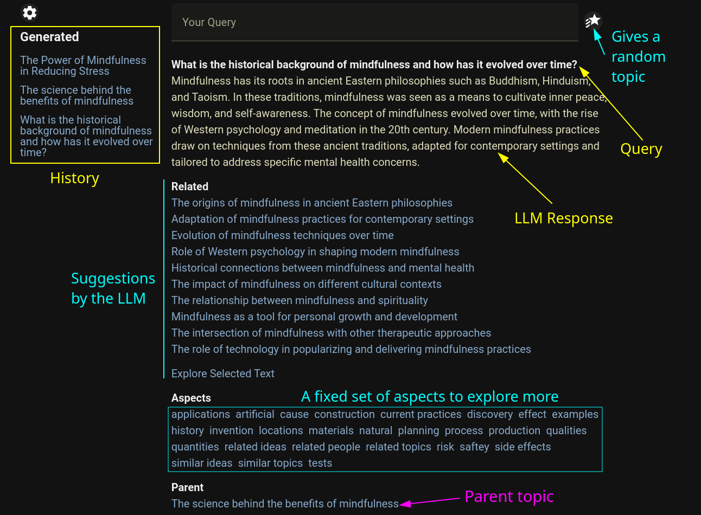

# llmbinge



This is a simple web-app to explore ideas based on LLM, with very little typing.
The basic idea is to use LLM to generate a response and also a set of suggestions for each response.
We can click on those suggestions to explore the topic further.

Currently [ollama](https://github.com/jmorganca/ollama) is the only supported backend.

## Features
1. Generation of response from queries (basic)
2. Generation of related queries and suggestions
3. Generation based on text selection
4. History management
5. Parent-child relation management for topics

## Development

Use the following commands to get the app running in dev mode:

```bash
https://github.com/charstorm/llmbinge.git
cd llmbinge/llmbinge
yarn install
yarn dev
```

The app uses the following fixed parameters (for now):
* ollama url = "http://localhost:11434/api/generate"
* model = mistral
